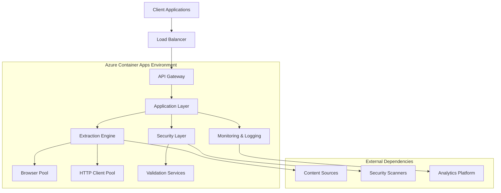
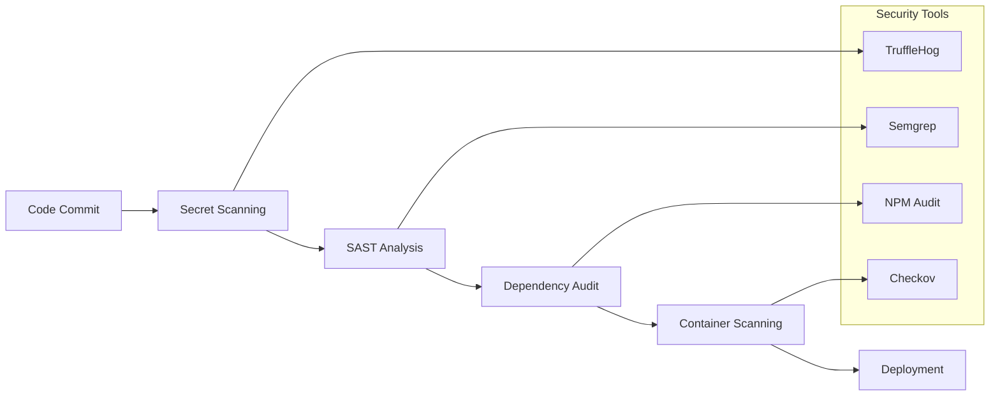
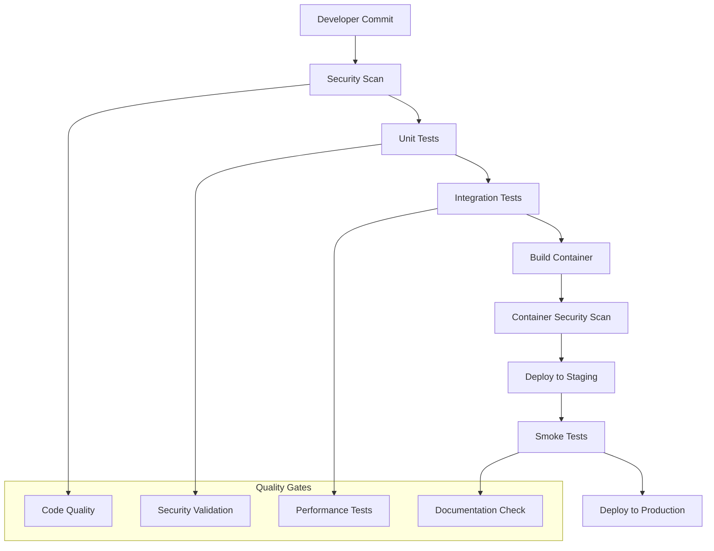
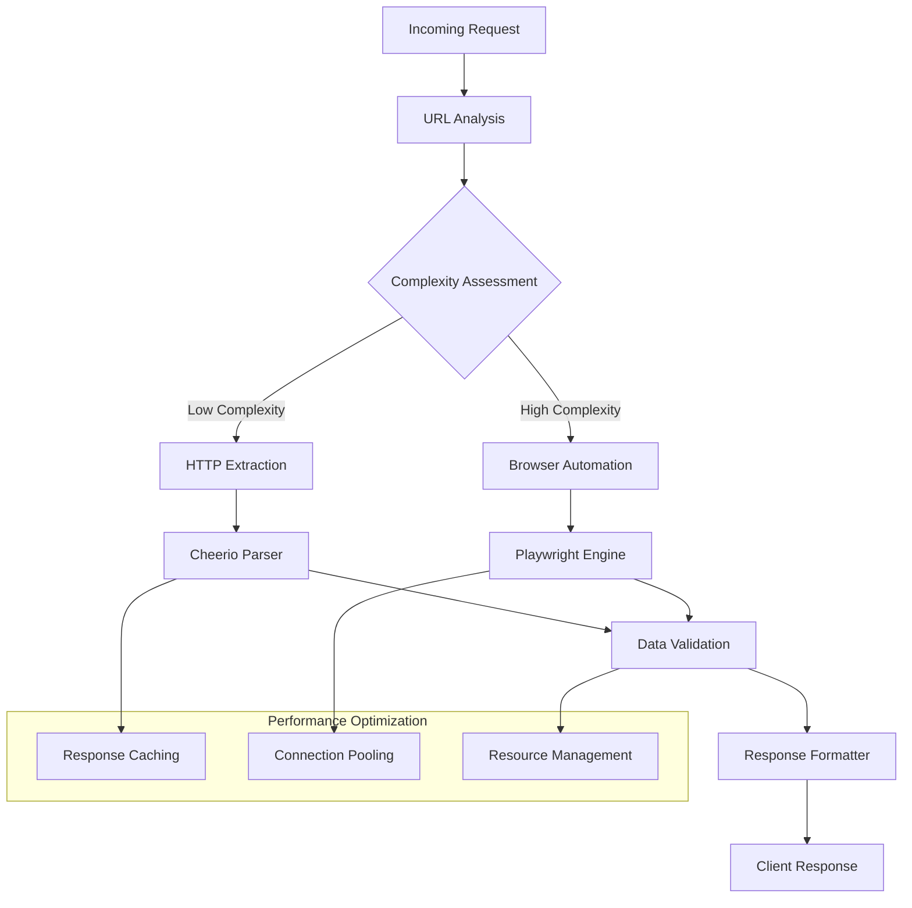
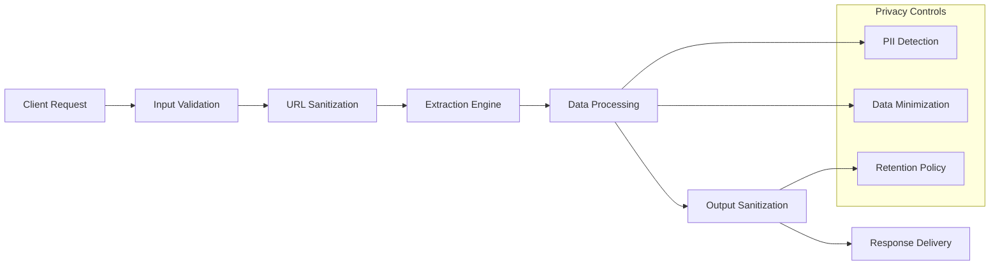

# 🏗️ Production Architecture Documentation (Sanitized)

## 🎯 Overview
This document provides a sanitized view of the production architecture for the hacksaws2x4 Advanced Data Extraction Engine, suitable for public documentation while protecting sensitive implementation details.

## 🌐 High-Level Architecture



## 🛡️ Security Architecture

### Security Layers
```yaml
security_layers:
  perimeter:
    - "Azure WAF (Web Application Firewall)"
    - "DDoS Protection Standard"
    - "SSL/TLS Termination"

  application:
    - "Rate Limiting (Express-rate-limit)"
    - "CORS Policy Enforcement"
    - "Input Validation & Sanitization"
    - "Security Headers (Helmet.js)"

  container:
    - "Non-root Container Execution"
    - "Minimal Base Images"
    - "Security Context Constraints"
    - "Network Policy Enforcement"

  infrastructure:
    - "Private Virtual Networks"
    - "Managed Identity Authentication"
    - "Key Vault Integration"
    - "Audit Logging"
```

### Security Validation Pipeline


## 🚀 Deployment Architecture

### Container Apps Configuration
```yaml
container_apps:
  scaling:
    min_replicas: 1
    max_replicas: 3
    cpu_threshold: 70%
    memory_threshold: 80%

  resources:
    cpu: "1.0 cores"
    memory: "2.0 GB"
    storage: "0.5 GB"

  networking:
    ingress:
      type: "external"
      port: 3000
      protocol: "http"

  health_checks:
    liveness_probe: "/health"
    readiness_probe: "/health"
    startup_probe: "/health"
```

### Environment Configuration
```yaml
environments:
  production:
    name: "prod-environment"
    region: "Central US"
    resource_group: "production-rg"

  staging:
    name: "staging-environment"
    region: "Central US"
    resource_group: "staging-rg"

  development:
    name: "dev-environment"
    region: "Central US"
    resource_group: "development-rg"
```

## 🔄 CI/CD Pipeline Architecture

### GitHub Actions Workflow


### Deployment Strategy
```yaml
deployment:
  strategy: "rolling_update"
  max_unavailable: "25%"
  max_surge: "25%"

  stages:
    - name: "staging"
      approval: "automatic"
      tests: ["smoke_tests", "integration_tests"]

    - name: "production"
      approval: "automatic"
      tests: ["health_checks", "monitoring_validation"]

  rollback:
    trigger: "health_check_failure"
    timeout: "5 minutes"
    strategy: "previous_stable_version"
```

## 📊 Monitoring & Observability

### Metrics Collection
```yaml
metrics:
  application:
    - "request_count"
    - "response_time"
    - "error_rate"
    - "extraction_success_rate"

  infrastructure:
    - "cpu_utilization"
    - "memory_usage"
    - "network_throughput"
    - "container_health"

  business:
    - "daily_active_extractions"
    - "api_usage_patterns"
    - "feature_adoption_rates"
    - "customer_satisfaction_scores"
```

### Alerting Configuration
```yaml
alerts:
  critical:
    - condition: "error_rate > 5%"
      notification: "immediate"
      escalation: "5 minutes"

    - condition: "response_time > 30s"
      notification: "immediate"
      escalation: "3 minutes"

  warning:
    - condition: "cpu_utilization > 80%"
      notification: "15 minutes"
      escalation: "30 minutes"

    - condition: "memory_usage > 85%"
      notification: "10 minutes"
      escalation: "20 minutes"
```

## 🧠 Extraction Engine Architecture

### Intelligent Routing System


### Browser Pool Management
```yaml
browser_pool:
  configuration:
    max_concurrent: 3
    idle_timeout: "30 seconds"
    max_lifetime: "5 minutes"

  optimization:
    preload_pages: true
    cache_browser_contexts: true
    reuse_sessions: true

  resource_limits:
    memory_per_browser: "512 MB"
    cpu_per_browser: "0.5 cores"
    max_page_size: "50 MB"
```

## 🔗 Integration Architecture

### External Service Integration
```yaml
integrations:
  authentication:
    provider: "Azure Active Directory"
    protocol: "OAuth 2.0"
    scopes: ["read", "extract"]

  storage:
    type: "Azure Blob Storage"
    encryption: "AES-256"
    backup: "geo_redundant"

  monitoring:
    platform: "Azure Monitor"
    log_analytics: "enabled"
    application_insights: "enabled"

  security:
    secret_management: "Azure Key Vault"
    certificate_management: "Azure Certificate Store"
    compliance_monitoring: "Azure Security Center"
```

### API Gateway Configuration
```yaml
api_gateway:
  rate_limiting:
    requests_per_minute: 100
    burst_capacity: 150

  authentication:
    required: true
    methods: ["api_key", "oauth2"]

  caching:
    enabled: true
    ttl: "5 minutes"
    cache_keys: ["url", "extraction_type"]

  compression:
    enabled: true
    algorithms: ["gzip", "br"]
```

## 📈 Performance Architecture

### Scaling Strategy
```yaml
scaling:
  horizontal:
    metric: "request_queue_depth"
    threshold: 10
    scale_out_cooldown: "2 minutes"
    scale_in_cooldown: "5 minutes"

  vertical:
    enabled: false
    reason: "horizontal_scaling_preferred"

  geographic:
    enabled: false
    future_consideration: true
    target_regions: ["West Europe", "East Asia"]
```

### Caching Strategy
```yaml
caching:
  levels:
    - name: "response_cache"
      type: "in_memory"
      ttl: "5 minutes"
      size_limit: "100 MB"

    - name: "extraction_cache"
      type: "distributed"
      ttl: "1 hour"
      size_limit: "1 GB"

    - name: "cdn_cache"
      type: "edge"
      ttl: "24 hours"
      size_limit: "unlimited"
```

## 🔒 Data Flow & Privacy

### Data Processing Pipeline


### Privacy & Compliance
```yaml
privacy:
  data_collection:
    principle: "data_minimization"
    retention: "7 days"
    anonymization: "immediate"

  compliance:
    frameworks: ["GDPR", "CCPA", "SOC2"]
    audit_frequency: "quarterly"
    documentation: "comprehensive"

  user_rights:
    access: "api_endpoint"
    deletion: "automated"
    portability: "json_export"
```

## 🎯 Disaster Recovery

### Backup Strategy
```yaml
backup:
  configuration:
    frequency: "daily"
    retention: "30 days"
    encryption: "AES-256"
    geographic_replication: true

  testing:
    frequency: "monthly"
    scenarios: ["data_corruption", "region_failure", "security_incident"]
    rto: "15 minutes"
    rpo: "1 hour"
```

### High Availability
```yaml
high_availability:
  availability_target: "99.9%"

  redundancy:
    application: "multi_instance"
    database: "not_applicable"
    networking: "azure_managed"

  failover:
    automatic: true
    detection_time: "30 seconds"
    switchover_time: "2 minutes"
```

## 📚 Documentation & Knowledge Management

### Technical Documentation
```yaml
documentation:
  api_reference:
    format: "openapi_3.0"
    generation: "automated"
    publication: "developer_portal"

  architecture:
    diagrams: "mermaid"
    updates: "version_controlled"
    review_cycle: "quarterly"

  operational:
    runbooks: "markdown"
    troubleshooting: "searchable_wiki"
    incident_procedures: "step_by_step"
```

### Knowledge Transfer
```yaml
knowledge_transfer:
  onboarding:
    duration: "1 week"
    materials: "comprehensive_guides"
    hands_on: "sandbox_environment"

  documentation:
    coverage: "100%"
    maintenance: "continuous"
    quality_gates: "peer_review"

  training:
    frequency: "quarterly"
    topics: ["security", "performance", "new_features"]
    format: ["workshops", "documentation", "hands_on"]
```

---

## 🔒 Security Notice

This documentation represents a sanitized view of the production architecture. Sensitive implementation details, credentials, and internal configurations have been removed or abstracted for security purposes.

For internal architectural details, refer to the confidential documentation available through secure channels.

---

*Production Architecture maintained by the hacksaws2x4 Platform Team*
*Last Updated: 2025-09-22*
*Classification: Public (Sanitized)*