# 🛡️ Security-First Deployment Guide

## Overview

This guide outlines our **mandatory security validation process** that **BLOCKS ALL DEPLOYMENTS** until 100% security validation is achieved. Every release must pass comprehensive security checks before deployment is allowed.

## 🚨 Mandatory Security Validation Process

### 🔥 **ZERO TOLERANCE POLICY**
- **ALL security validations must PASS before deployment**
- **ANY security failure immediately BLOCKS deployment**
- **NO EXCEPTIONS - Security cannot be bypassed**

### 📋 Pre-Deployment Security Checklist

Run this command before ANY deployment:
```bash
npm run deploy:check
```

This runs:
1. `npm run security:validate` - Comprehensive security validation
2. `npm run test:all` - All security tests, linting, and unit tests

## 🛡️ Security Validation Components

### 1. **Dependency Security**
- ✅ `npm audit` - 0 vulnerabilities required
- ✅ Package signature verification
- ✅ Supply chain integrity checks
- ✅ Outdated package detection

### 2. **Secrets & Data Protection**
- ✅ Checkov secrets scanning
- ✅ Common secret pattern detection
- ✅ `.env` file exclusion verification
- ✅ Sensitive data exposure checks

### 3. **Browser Automation Security**
- ✅ Secure browser launch options
- ✅ Webdriver detection measures
- ✅ Context isolation validation
- ✅ Anti-fingerprinting verification

### 4. **Supply Chain Integrity**
- ✅ Package lock file presence
- ✅ Dependency pinning validation
- ✅ Registry signature verification
- ✅ Attestation confirmation

### 5. **Code Quality & Security**
- ✅ ESLint security rules
- ✅ Deprecated feature detection
- ✅ Production code hygiene
- ✅ Error exposure prevention

### 6. **Infrastructure Security**
- ✅ Production environment config
- ✅ HTTPS enforcement
- ✅ Security header validation
- ✅ Access control verification

## 🚀 Deployment Commands

### Azure Container Registry Deployment (Recommended)

Our production deployment uses Azure Container Registry with automatic artifact refresh:

```bash
# Trigger automated container deployment
git add . && git commit -m "Deploy to production" && git push origin main

# Monitor deployment status
az containerapp show --name genz-translator-api --resource-group dugganusa-RG

# Get deployment URL
az containerapp show --name genz-translator-api --resource-group dugganusa-RG \
  --query "properties.configuration.ingress.fqdn" --output tsv
```

**Infrastructure:**
- **Azure Container Registry**: `genztranslatoracr.azurecr.io`
- **Location**: US Central
- **Environment**: `genz-translator-env`
- **Auto-scaling**: 1-3 replicas based on load

### Local Development Validation
```bash
# Run full security validation
npm run security:validate

# Run complete deployment check
npm run deploy:check

# Generate security report
npm run security:report
```

### CI/CD Pipeline

Our automated CI/CD pipeline enforces security at multiple levels:

```mermaid
graph TD
    A[Code Push] --> B[🛡️ Mandatory Security Validation]
    B --> C{Security Pass?}
    C -->|❌ FAIL| D[🚨 DEPLOYMENT BLOCKED]
    C -->|✅ PASS| E[Test Suite]
    E --> F[Vulnerability Scan]
    F --> G[Build & Deploy Check]
    G --> H[🎉 Deployment Approved]
    D --> I[Fix Security Issues]
    I --> A
```



## 📊 Security Validation Reports

### Automated Report Generation

Every validation run generates a comprehensive security report:

```json
{
  "timestamp": "2025-09-19T13:30:00Z",
  "version": "3.0.0",
  "git_sha": "abc123...",
  "validation_results": {
    "passed": 18,
    "failed": 0,
    "warnings": 2,
    "total": 20
  },
  "security_status": "APPROVED"
}
```

### Report Locations
- **Local**: `security-validation-report.json`
- **CI/CD**: Available as build artifacts
- **PR Comments**: Automatic security status updates

## 🔄 Release Process Integration

### 1. **Release Notes Template**
Every release MUST use `.github/RELEASE_NOTES_TEMPLATE.md` which includes:
- ✅ Mandatory security checklist
- ✅ Security audit results
- ✅ Vulnerability scan results
- ✅ Supply chain verification

### 2. **Version Control**
```bash
# Before creating release
npm run deploy:check

# Generate release notes
cp .github/RELEASE_NOTES_TEMPLATE.md RELEASE_NOTES_v3.0.0.md
# Fill in version-specific details

# Tag release only after security validation
git tag -a v3.0.0 -m "Release v3.0.0 - Security validated"
```

## 🚨 Security Incident Response

### If Security Validation Fails

1. **IMMEDIATE ACTION**:
   - ⛔ **STOP all deployment activities**
   - 🔍 **Review security validation report**
   - 🛠️ **Fix ALL failed security checks**

2. **Resolution Process**:
   ```bash
   # Fix security issues
   # Re-run validation
   npm run security:validate

   # Only proceed if ALL checks pass
   npm run deploy:check
   ```

3. **Documentation**:
   - Document security issues found
   - Update security procedures if needed
   - Review and improve validation checks

### Security Escalation

For critical security issues:
1. **Immediately halt deployment**
2. **Contact security team**
3. **Create incident report**
4. **Implement additional safeguards**

## 🔧 Configuration Files

### Key Security Files
- `scripts/deploy-security-check.sh` - Main validation script
- `.github/RELEASE_NOTES_TEMPLATE.md` - Security checklist template
- `.github/workflows/ci.yml` - CI/CD security enforcement
- `package.json` - Security validation commands

### Environment Variables
```bash
# Security validation settings
SECURITY_VALIDATION_REQUIRED=true
DEPLOYMENT_BLOCK_ON_SECURITY_FAIL=true
SECURITY_REPORT_GENERATION=enabled
```

## 📚 Best Practices

### Development Workflow
1. **Before every commit**: Run `npm run security:validate`
2. **Before every PR**: Ensure security validation passes
3. **Before every release**: Complete full security checklist
4. **Regular audits**: Weekly security validation runs

### Team Responsibilities
- **Developers**: Must ensure security validation passes locally
- **Reviewers**: Must verify security status in PR reviews
- **Release Managers**: Must complete security checklist in release notes
- **DevOps**: Must maintain CI/CD security enforcement

## 🎯 Success Metrics

### Security KPIs
- **100%** security validation pass rate before deployment
- **0** vulnerabilities in production deployments
- **100%** of releases include security validation results
- **<24h** resolution time for security validation failures

### Monitoring
- Daily security validation status
- Weekly dependency security audits
- Monthly security process reviews
- Quarterly security training updates

---

## ⚡ Quick Reference

### Essential Commands
```bash
# Security validation
npm run security:validate

# Full deployment check
npm run deploy:check

# Generate security report
npm run security:report

# Emergency security scan
./scripts/deploy-security-check.sh
```

### Status Indicators
- 🟢 **APPROVED**: All security validations passed - Safe to deploy
- 🔴 **REJECTED**: Security validation failed - Deployment blocked
- ⚠️ **WARNINGS**: Issues found but not blocking - Review recommended

---

**Remember: Security is non-negotiable. When in doubt, halt deployment and consult the security team.**