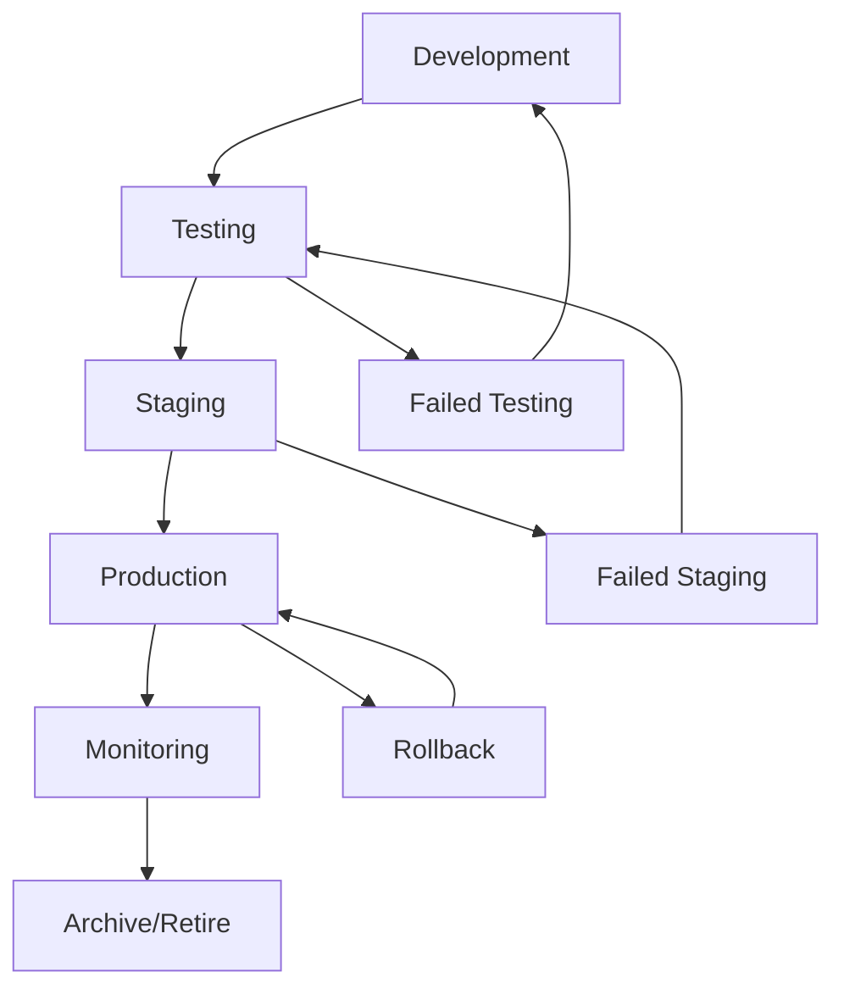

# 🏷️ Artifact Lifecycle & Tagging Strategy

## Overview
This document defines the comprehensive tagging strategy for artifact lifecycle management, validation tracking, and production hygiene across the hacksaws2x4 platform.

## 🎯 Tagging Categories

### 1. Production Status Tags
```yaml
production_tags:
  prod-live: "Currently deployed and serving traffic"
  prod-staging: "Staging environment deployment"
  prod-candidate: "Ready for production promotion"
  prod-rollback: "Previous stable version for rollback"
  prod-deprecated: "No longer in production use"
```

### 2. Validation State Tags
```yaml
validation_tags:
  security-validated: "Passed all security scans"
  security-pending: "Security validation in progress"
  security-failed: "Security validation failed"
  test-validated: "All tests passing"
  test-pending: "Test suite running"
  test-failed: "Test failures detected"
  compliance-validated: "Regulatory compliance verified"
  performance-validated: "Performance benchmarks met"
```

### 3. Feature Lifecycle Tags
```yaml
feature_tags:
  feature-alpha: "Early development stage"
  feature-beta: "Beta testing phase"
  feature-stable: "Stable and production-ready"
  feature-deprecated: "Marked for removal"
  feature-experimental: "Experimental implementation"
```

### 4. Architecture Tags
```yaml
architecture_tags:
  arch-microservice: "Microservice component"
  arch-monolith: "Monolithic architecture"
  arch-serverless: "Serverless implementation"
  arch-container: "Containerized deployment"
  arch-legacy: "Legacy system component"
```

### 5. Security Classification Tags
```yaml
security_tags:
  sec-public: "Public-facing component"
  sec-internal: "Internal system access"
  sec-restricted: "Restricted access required"
  sec-confidential: "Confidential data handling"
  sec-encrypted: "Encryption required"
```

### 6. DORA Metrics Tags
```yaml
dora_tags:
  dora-elite: "Elite performer status"
  dora-high: "High performer status"
  dora-medium: "Medium performer status"
  dora-low: "Low performer status"
  dora-baseline: "Baseline measurement"
```

## 🔄 Artifact Lifecycle Management

### Lifecycle States


### Tagging Rules by Lifecycle State

#### Development Phase
- Required Tags: `feature-alpha`, `security-pending`, `test-pending`
- Optional Tags: `arch-*`, `experimental`

#### Testing Phase
- Required Tags: `test-validated` or `test-failed`, `security-validated` or `security-failed`
- Promoted Tags: Remove `*-pending`, add validation results

#### Staging Phase
- Required Tags: `prod-staging`, `test-validated`, `security-validated`
- Performance Tags: `performance-validated`

#### Production Phase
- Required Tags: `prod-live`, all validation tags passed
- DORA Tags: `dora-*` based on performance metrics

#### Archive Phase
- Required Tags: `prod-deprecated`, `arch-legacy`
- Cleanup Tags: Remove active validation tags

## 🧹 Hygiene Management

### Automated Cleanup Rules

#### Stale Artifact Detection
```yaml
cleanup_rules:
  test_artifacts:
    pattern: "test-*"
    retention: "7 days"
    action: "delete"

  debug_files:
    pattern: "debug-*", "*.debug"
    retention: "3 days"
    action: "archive"

  deployment_packages:
    pattern: "deploy-*.zip"
    retention: "30 days"
    action: "archive"

  security_reports:
    pattern: "*-security-*.json"
    retention: "90 days"
    action: "secure_archive"
```

#### Tag-Based Cleanup
```yaml
tag_cleanup:
  deprecated_features:
    tags: ["feature-deprecated", "arch-legacy"]
    action: "archive_after_30_days"

  failed_validations:
    tags: ["security-failed", "test-failed"]
    action: "review_and_cleanup"

  experimental_features:
    tags: ["feature-experimental"]
    retention: "14 days"
    action: "promote_or_remove"
```

## 📊 Pipeline Integration

### GitHub Actions Tagging
```yaml
github_actions_tags:
  on_commit:
    - "commit-{sha}"
    - "branch-{branch-name}"
    - "author-{author}"

  on_pull_request:
    - "pr-{number}"
    - "review-pending"

  on_merge:
    - "merged-{timestamp}"
    - "target-{branch}"

  on_release:
    - "release-{version}"
    - "prod-candidate"
```

### Azure DevOps Integration
```yaml
azure_tags:
  deployment:
    - "azure-{environment}"
    - "container-{app-name}"
    - "region-{location}"

  monitoring:
    - "health-{status}"
    - "performance-{tier}"
    - "scale-{instance-count}"
```

## 🎓 Student Framework Tags

### Progress Tracking Tags
```yaml
student_tags:
  curriculum:
    - "week-{1-4}"
    - "day-{1-30}"
    - "module-{name}"
    - "skill-{level}"

  achievements:
    - "milestone-{name}"
    - "dora-improvement-{percentage}"
    - "competency-{skill}"

  validation:
    - "assignment-completed"
    - "peer-reviewed"
    - "mentor-approved"
    - "portfolio-ready"
```

### Certification Tags
```yaml
certification_tags:
  levels:
    - "beginner-certified"
    - "intermediate-certified"
    - "advanced-certified"
    - "elite-certified"

  specializations:
    - "security-specialist"
    - "devops-specialist"
    - "ai-collaboration-specialist"
    - "architecture-specialist"
```

## 🔍 Monitoring & Alerting

### Tag-Based Monitoring
```yaml
monitoring_rules:
  production_health:
    tags: ["prod-live"]
    metrics: ["uptime", "performance", "error_rate"]
    alerts: ["critical", "warning"]

  security_compliance:
    tags: ["security-validated"]
    checks: ["vulnerability_scan", "compliance_audit"]
    frequency: "daily"

  performance_tracking:
    tags: ["dora-*"]
    metrics: ["deployment_frequency", "lead_time", "recovery_time", "failure_rate"]
    reporting: "weekly"
```

### Alerting Thresholds
```yaml
alert_thresholds:
  security_failed:
    condition: "tags contains 'security-failed'"
    severity: "critical"
    notification: "immediate"

  test_failed:
    condition: "tags contains 'test-failed'"
    severity: "warning"
    notification: "within_1_hour"

  deprecated_in_production:
    condition: "tags contains 'prod-live' AND 'feature-deprecated'"
    severity: "critical"
    notification: "immediate"
```

## 📈 Metrics & Reporting

### Tag-Based Analytics
```yaml
analytics:
  deployment_velocity:
    source_tags: ["prod-live", "release-*"]
    calculation: "deployments_per_day"

  security_posture:
    source_tags: ["security-validated", "security-failed"]
    calculation: "validation_success_rate"

  quality_trends:
    source_tags: ["test-validated", "test-failed"]
    calculation: "quality_score_over_time"

  feature_lifecycle:
    source_tags: ["feature-*"]
    calculation: "time_to_production"
```

### Dashboard Visualization
```yaml
dashboards:
  production_overview:
    widgets:
      - "artifacts_by_production_status"
      - "validation_state_distribution"
      - "dora_metrics_current"

  security_dashboard:
    widgets:
      - "security_validation_trends"
      - "compliance_status"
      - "vulnerability_aging"

  student_progress:
    widgets:
      - "curriculum_completion_rates"
      - "dora_improvement_tracking"
      - "certification_achievement"
```

## 🚀 Implementation Guide

### Phase 1: Core Tagging (Week 1)
1. Implement production status tags
2. Add validation state tags
3. Configure basic cleanup rules

### Phase 2: Automation (Week 2)
1. Integrate with GitHub Actions
2. Configure Azure DevOps tagging
3. Implement automated cleanup

### Phase 3: Advanced Features (Week 3)
1. Add DORA metrics tags
2. Implement student framework tags
3. Configure monitoring and alerting

### Phase 4: Analytics (Week 4)
1. Deploy tag-based analytics
2. Create visualization dashboards
3. Enable automated reporting

## 🔒 Security Considerations

### Tag Security
- Never include sensitive data in tag names
- Use hashed values for user identification
- Implement access controls for tag modification
- Audit tag changes for compliance

### Compliance Requirements
- Maintain tag history for audit trails
- Implement retention policies
- Ensure GDPR compliance for user tags
- Regular security reviews of tagging practices

---

*This tagging strategy enables comprehensive artifact lifecycle management while maintaining security and enabling powerful analytics for continuous improvement.*